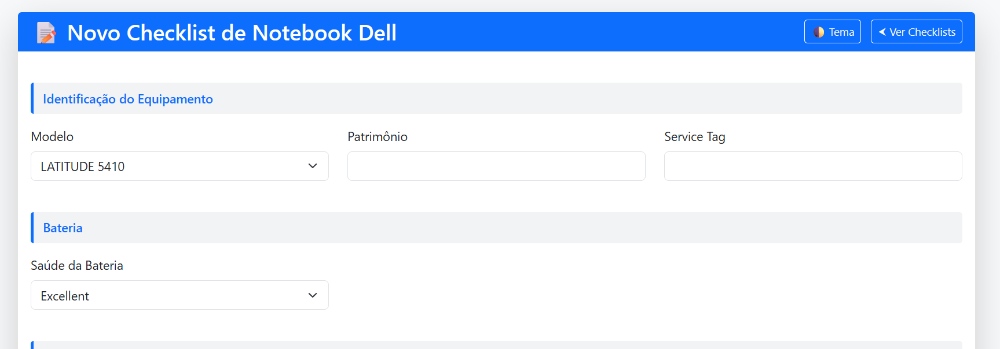
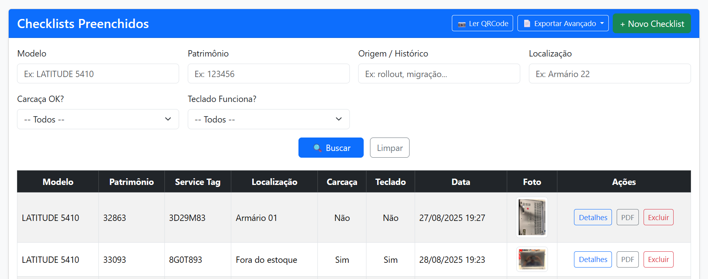
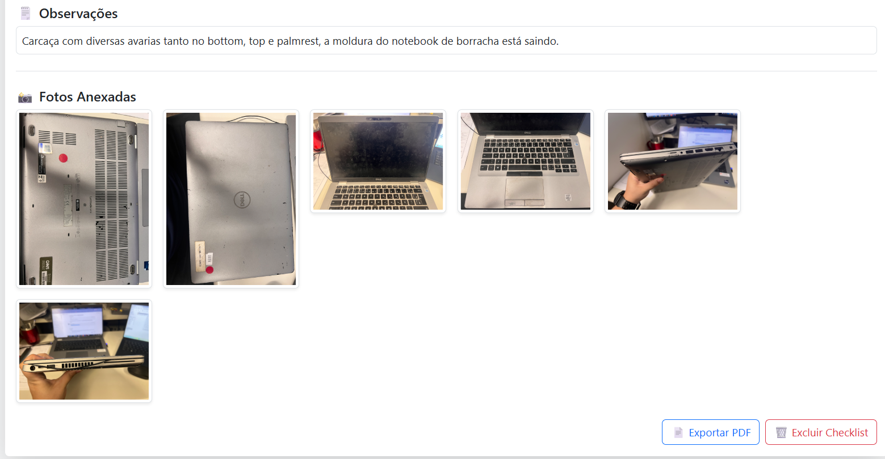

# 📘 Dell Notebook Checklist

Sistema web para registro, auditoria e exportação de checklists de notebooks Dell.  
Desenvolvido como projeto pessoal para estudo e portfólio.

---

## 🚀 Tecnologias Utilizadas

- **Java 17**
- **Spring Boot 3**
- **Spring MVC + Spring Data JPA**
- **MySQL**
- **Thymeleaf**
- **Bootstrap 5**
- **OpenPDF**
- **ZXing (QR Code)**
- **AWS S3** (opcional)

---

## 📸 Prévia da Interface

> Para funcionar, coloque suas imagens reais dentro da pasta `docs/`  
> com os nomes abaixo:

### Tela de Cadastro


### Tela de Listagem


### Tela de Detalhes


---

## ✨ Funcionalidades

- Cadastro completo com:
  - Modelo, Patrimônio e Service Tag
  - Estado da bateria
  - Condição da carcaça
  - Funcionamento do teclado
  - Observações
  - Upload de múltiplas fotos
- Filtros avançados na listagem
- Galeria de imagens
- Exportação rápida de PDF
- Leitura de QR Code
- Interface moderna e responsiva

---

## 🗂️ Estrutura do Projeto

```
src/main/java/br.guijas1.checklistDell
 ├── controller
 ├── service
 ├── repository
 ├── entity
 └── config
```

---

## 🧪 Como Executar Localmente

### Pré-requisitos
- Java 17+
- Maven
- MySQL

### Criar o banco de dados

```sql
CREATE DATABASE checklist;
```

### Configurar o `application.properties`

```properties
spring.datasource.url=jdbc:mysql://localhost:3306/checklist
spring.datasource.username=SEU_USUARIO
spring.datasource.password=SUA_SENHA

file.upload-dir=uploads/
```

### Rodar o projeto

```bash
mvn spring-boot:run
```

Acesse:

```
http://localhost:8080
```

---

## 🐳 Docker (opcional)

Criar a imagem:

```bash
docker build -t checklist .
```

Executar:

```bash
docker run -p 8080:8080 checklist
```

---

## 🔍 Principais Rotas

| Rota | Descrição |
|------|-----------|
| `/checklist` | Cadastro de novo checklist |
| `/checklists` | Listagem geral |
| `/checklists/{id}` | Detalhamento |
| `/checklists/{id}/exportar` | Exportação em PDF |
| `/qrcode` | Leitura de QR Code |

---

## 👨‍💻 Autor

**Guijas Rodrigues**  
Desenvolvedor Full Stack  
📧 guijas.dev@gmail.com

---

## 🛡️ Licença

Projeto demonstrativo. Uso livre para estudo.